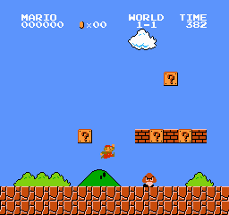

# Super Mario AI 
Super Mario Bros has always been a classic. Older games always bring back good memories. The lower resolution makes it easy to implement deep learning and various other models without compromising on the performance.

## Under the hood
This project implements reinforcement learning over Mario in the game and has a reward system that allows the agent to learn the rules of the game over time.

## Requirements
- Gym `pip install gym`
- Gym Super Mario Bros `pip install gym-super-mario-bros`
- NES-Py `pip install nes-py`
(This program runs on Linux and Mac, sorry Windows users)

To run a level
`python main.py <level you want to run>`

For example, if you want to run level 1-1

`python main.py '1-1'`

## Images

